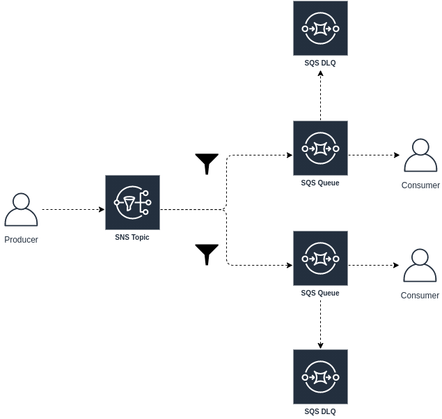

# Building Block de Eventos Baseado em SNS e SQS

Este building block é um template projetado para padronizar a sincronização de eventos e comandos por meio de fanout, incluindo eventos de resposta caso sejam necessários, utilizando o Amazon Simple Notification Service (SNS) e o Amazon Simple Queue Service (SQS). 

Além disso, inclui a implementação do padrão de dead-letter queue (DLQ) para cada fila assinante, garantindo uma abordagem robusta para o tratamento de mensagens que não podem ser processadas com sucesso.

Cada componente é essencial para a eficácia da arquitetura, facilitando a integração e o gerenciamento eficiente de eventos e comandos:

- **Tópico SNS**: Cria o tópico SNS para facilitar a comunicação entre as filas SQS e os produtores de eventos, garantindo um modelo de fanout para propagar eventos para múltiplos consumidores de forma eficiente.

- **Filas SQS**: Cria as filas SQS principais assinantes do tópico SNS, com políticas de redrive para direcionar mensagens para a DLQ após um número específico de tentativas de processamento.

- **Filas SQS (DLQ)**: Cria as filas SQS de Dead Letter Queue (DLQ) associadas às filas principais, permitindo o armazenamento de mensagens que falharam no processamento.



  
## Parametrização Flexível dos Recursos

O objetivo deste template é fornecer uma maneira parametrizada e flexível de provisionar os recursos necessários para o Building Block de Eventos Baseado em SNS e SQS. 

As variáveis abaixo permitem configurar os recursos de acordo com as necessidades específicas do ambiente:


### Arquivo `variables.tf` - Documentação

Essas variáveis permitem uma configuração flexível e parametrizada para a criação dos recursos de mensageria na AWS, como tópicos SNS e filas SQS, atendendo às necessidades específicas do building block proposto, como região, tipo de fila (FIFO ou não), nomes das filas e políticas de filtragem de mensagens.

Cada bloco de variável tem um propósito específico, detalhado a seguir:

---

#### `aws_region`

- **Objetivo**: Define a região da AWS onde os recursos serão criados.
- **Descrição**: Esta variável é utilizada para especificar a região geográfica da AWS onde os serviços como SNS e SQS serão implantados.
- **Valor**: "us-east-1"
  
---

#### `sns_topic`

- **Objetivo**: Define o nome do tópico SNS a ser criado.
- **Descrição**: O tópico SNS é uma entidade central em mensageria de pub/sub (publicação/assinatura) da AWS. Esta variável define o nome do tópico que será utilizado para notificações.
- **Valor**: "confirmed_sale"
  
---

#### `is_fifo_topic`

- **Objetivo**: Indica se o tópico SNS deve ser FIFO (First-In-First-Out) ou não.
- **Descrição**: Quando esta variável é configurada como `true`, o tópico SNS será configurado para seguir a ordem de chegada das mensagens (FIFO), garantindo uma entrega ordenada.
- **Tipo**: Booleano (`true` ou `false`)
- **Valor**: `false`

---

#### `sqs_queues`

- **Objetivo**: Define os nomes das filas SQS a serem criadas.
- **Descrição**: As filas SQS são utilizadas para armazenar mensagens em um ambiente de filas de mensagens. Esta variável especifica os nomes das filas que serão criadas.
- **Valor**: ["order", "payment", "shipment"]

---

#### `max_receive_count`

- **Objetivo**: Define a quantidade máxima de recebimentos de mensagens com falha
- **Descrição**: Esta variável especifica a quantidade de mensagens com falha que podem ser processadas antes de serem enviadas para a fila DLQ.
- **Valor**: 2

---

#### `is_fifo_queues`

- **Objetivo**: Indica se as filas SQS devem ser FIFO (First-In-First-Out) ou não.
- **Descrição**: Similar ao `is_fifo_topic`, esta variável define se as filas SQS devem seguir a ordem de chegada das mensagens (FIFO) ou não.
- **Tipo**: Lista de booleanos (`true` ou `false`) para cada fila especificada em `sqs_queues`.
- **Valor**: [false, false, false]

---

#### `use_filter`

- **Objetivo**: Indica se a fila deve ter filtro (true) ou não (false).
- **Descrição**: Esta variável é utilizada para indicar se cada fila SQS deve ter um filtro associado para - determinar quais mensagens são entregues a essa fila.
- **Tipo**: Lista de booleanos (true ou false) para cada fila especificada em sqs_queues.
- **Valor**: [true, true, false]

---

#### `filter_policies`

- **Objetivo**: Define os filtros de política para cada assinatura nas filas SQS.
- **Descrição**: Esta variável é utilizada para especificar os filtros de política para diferentes tipos de mensagens que serão direcionadas para cada fila SQS.
- **Valor**: 
  ```json
  {
    "order":    { "eventType": ["order_placed"] },
    "payment":  { "eventType": ["payment_received"] },
    "shipment": { "eventType": ["shipment_dispatched"] }
  }
  ```

Isso significa que as mensagens com eventos de order_placed serão enviadas para a fila order, mensagens com eventos de payment_received para a fila payment, e mensagens com eventos de shipment_dispatched para a fila shipment.

---

#### `return_sns_topics` (Opcional)

- **Objetivo**: Define os nomes dos tópicos SNS de retorno.
- **Descrição**: Esta variável é utilizada para definir os nomes dos tópicos SNS que serão criados para lidar com respostas de consumidores para produtores.
- **Tipo**: Lista de strings.
- **Valor**: ["return_confirmed_sale"]

---

#### `is_fifo_return_topics` (Deve ser preenchido caso haja tópico de retorno)

- **Objetivo**: Indica se os tópicos SNS de retorno devem ser FIFO (First-In-First-Out) ou não.
- **Descrição**: Quando esta variável é configurada como true, os tópicos SNS de retorno serão configurados para seguir a ordem de chegada das mensagens (FIFO).
- **Tipo**: Lista de booleanos (true ou false) para cada tópico especificado em return_sns_topics.
- **Valor**: [false]

---

#### `return_sqs_queues` (Deve ser preenchido caso haja tópico de retorno)

- **Objetivo**: Define os nomes das filas SQS de retorno.
- **Descrição**: Esta variável é utilizada para definir os nomes das filas SQS de retorno que serão criadas para lidar com respostas de consumidores para produtores.
- **Tipo**: Lista de strings.
- **Valor**: ["order_return"].

---

#### `is_fifo_return_queues` (Deve ser preenchido caso haja tópico e filas de retorno)

- **Objetivo**: Indica se as filas SQS de retorno devem ser FIFO (First-In-First-Out) ou não.
- **Descrição**: Quando esta variável é configurada como true, as filas SQS de retorno serão configuradas para seguir a ordem de chegada das mensagens (FIFO).
- **Tipo**: Lista de booleanos (true ou false) para cada fila especificada em return_sqs_queues.
- **Valor**: [false]

---

## Testando as Filas DLQ

Para testar o funcionamento das filas DLQ, vamos seguir os passos abaixo:

- **Processar a mensagem até falhar**:
  - Vamos produzir 2 ou mais mensagens para uma das filas, vamos utilizar como exemplo a fila **payment**.
  - No menu à esquerda, clique em **Enviar e receber mensagens** e depois em **Ver mensagens**.
  - Isso simula um consumidor da fila pegando a mensagem para processamento.
  - Uma das mensagens deve aparecer na tela. Clique em "Iniciar busca de mensagens" e depois em "Interromper a busca". Repita esse passo mais 3 vezes (um total de 4 vezes).
  - Após a quarta tentativa, a mensagem será redirecionada automaticamente para a DLQ **payment.dlq** associada à **payment**.

O procedimento acima simula o processamento com falhas no consumo da mensagem até que ela seja redirecionada para a fila DLQ após o número de tentativas definido pela variável maxReceiveCount.
