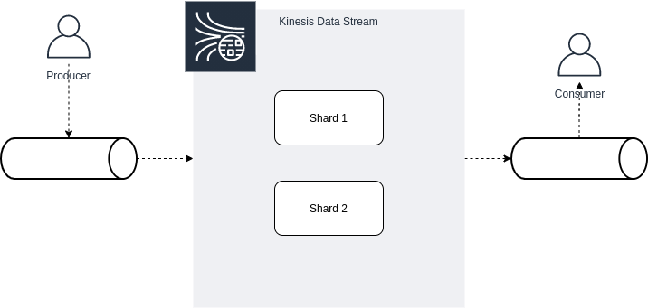

# Building Block de Eventos Baseado em Kinesis

Este building block é um template projetado para facilitar a criação de streams no  Kinesis Data Stream, permitindo uma configuração flexível e parametrizada para processamento de dados em tempo real.

Ele é usado para coletar, processar e analisar grandes volumes de dados em tempo real, sendo especialmente útil em aplicações que exigem baixa latência, como análises em tempo real, monitoramento de logs, detecção de fraudes e muito mais.





## Anatomia Básica do Amazon Kinesis

O Amazon Kinesis é composto por três partes principais:

- **Streams**: Um stream é um fluxo de dados onde os dados são armazenados temporariamente. Ele é como um canal que permite a ingestão de dados em tempo real. Os streams são projetados para suportar um alto volume de dados em tempo real e são altamente escaláveis.

- **Shards**: Um shard é uma unidade de capacidade de processamento dentro de um stream Kinesis. Cada shard tem uma capacidade máxima de processamento de dados, limitada a 1 MB por segundo para gravação e 2 MB por segundo para leitura. Essa capacidade de processamento é compartilhada entre todos os produtores e consumidores que interagem com o shard. Adicionar mais shards a um stream aumenta a capacidade total de processamento, permitindo lidar com mais dados em paralelo.

- **Data**: Os dados dentro de um stream Kinesis são os registros individuais que são enviados e processados. Cada registro é uma unidade de dados que contém a informação enviada para o stream. Esses registros podem ser logs de servidores, eventos de sensores, transações financeiras, tweets, ou qualquer outro tipo de dado que precisa ser capturado e processado em tempo real. Cada registro é atribuído a um shard para armazenamento e processamento subsequente.

## Parametrização Flexível dos Recursos

O objetivo deste template é fornecer uma maneira parametrizada e flexível de provisionar os recursos necessários para o Building Block de Eventos Baseado em Kinesis Data Stream. 

As variáveis abaixo permitem configurar os recursos de acordo com as necessidades específicas do ambiente:

### Arquivo `variables.tf` - Documentação

Este arquivo `variables.tf` é utilizado para definir as variáveis necessárias para a criação de recursos na AWS (Amazon Web Services) dentro de um ambiente de arquitetura de stream de dados.

Cada bloco de variável tem um propósito específico, detalhado a seguir:

---

#### `aws_region` 

- **Objetivo**: Define a região da AWS onde os recursos Kinesis Streams serão criados.
- **Descrição**: Esta variável é utilizada para especificar a região geográfica da AWS onde os serviços Kinesis Streams serão implantados.
- **Tipo**: String.
- **Valor**: "us-east-1"

---

#### `kinesis_streams` 

- **Objetivo**: Define os nomes dos Kinesis Streams a serem criados.
- **Descrição**: Esta variável é uma lista que especifica os nomes dos Kinesis Streams que serão criados.
- **Tipo**: Lista de strings.
- **Valor**: ["stream1", "stream2"].

---

#### `retention_period` 

- **Objetivo**: Define o período de retenção em horas para cada stream.
- **Descrição**: Esta variável é uma lista que define o período de retenção em horas para cada Kinesis Stream. Cada valor na lista corresponde ao período de retenção em horas para o respectivo stream na lista kinesis_streams.
- **Tipo**: Lista de números
- **Valor**: [24, 48]

---

#### `shard_capacity` 

- **Objetivo**: Define a capacidade em megabytes por shard para cada stream.
- **Descrição**: Esta variável é uma lista que define a capacidade em megabytes por shard para cada Kinesis Stream. Cada valor na lista corresponde à capacidade em megabytes por shard para o respectivo stream na lista kinesis_streams.
- **Tipo**: Lista de números
- **Valor**: [1, 2]

---


## Produzindo uma Mensagem no Stream

Para produzir uma mensagem em um dos streams Kinesis:

- Utilize o AWS CLI para enviar uma mensagem para o stream. Por exemplo, para enviar uma mensagem para o *stream1*:


```bash
aws kinesis put-record --stream-name stream1 --partition-key 123 --data "Sua mensagem aqui"
```

Substitua *stream1* pelo nome do stream desejado e *Sua mensagem aqui* pela mensagem que deseja enviar.


## Consumindo a Mensagem do Stream

Para consumir a mensagem do stream:

1. Utilize o AWS CLI para obter os registros do stream:

```bash
aws kinesis get-records --shard-iterator $(aws kinesis get-shard-iterator --stream-name stream1 --shard-id shardId-000000000001 --shard-iterator-type TRIM_HORIZON --query 'ShardIterator' --output text)
```

Substitua *stream1* pelo nome do stream desejado e *shardId-000000000001* pelo ID do shard onde a mensagem foi gravada.

2. O comando retornará uma resposta codificada em base64. Decodifique a resposta usando um site como (base64decode.org) ou no terminal usando o comando base64:

```bash
echo "Sua resposta codificada em base64" | base64 --decode
```
Substitua *Sua resposta codificada* em base64 pela resposta que você recebeu do comando anterior.

É possível decodificar a mensagem em base64 pelo site [base64.org](https://www.base64decode.org/)
